Run everything from the `forecasting_odemodels code/` folder, with that
folder on the MATLAB path.

Run the steps **in order** - each one reads files written by the
previous one.

# Part A - Practice run (Ebola scenario 1)

Nothing needs editing. All configuration is already set to $C = 20$
weeks, $H = 4$ weeks, $s = 4$ weeks, 5 windows.

### 1. Fit each model across all rolling windows

    batch_GLM_ebola_scenario1
    batch_GOM_ebola_scenario1
    batch_RICH_ebola_scenario1

Slowest step (bootstrap refits, `B = 300` per window per model). Writes
parameter estimates, forecast curves, bootstrap trajectories and
per-window performance files to `output/`.

### 2. Collect metrics

    collect_metrics_simple()

Writes `forecast_metrics_summary.mat` / `.csv` --- MAE, MSE, coverage,
WIS and AICc for every model-window pair. **This file supplies both JCF
inputs** (`WIS_calib` and `WIS_forecast`), so steps 1--2 never need
repeating for JCF.

### 3. Baseline ensemble (calibration-only weights)

    create_ensemble_simple()

Weights each model by $1/{WIS}^{cal}$, pools with the linear pool.
Writes `ensemble_results.mat` / `.csv` and
`output/Forecast-Ensemble-LinearPool-*.csv`.

### 4. Baseline plots

    plot_model_fit_simple()
    plot_forecasts_simple()

Figures go to `plots/`.

### 5. JCF ensembles

    run_jcf_sweep()

Runs $\lambda \in \{ 0,\ 0.25,\ 0.5,\ 0.75,\ \text{length},\ 1\}$, where
`'length'` means $\lambda = C/(C + H)$. Each run writes its own tagged
files (`ensemble_results_JCF-lam050.*`, `JCF-lamlen`, ...), so nothing
overwrites the baseline from step 3.

For a single $\lambda$ instead: `create_ensemble_jcf()` (edit
`config.lambda`).

### 6. Compare schemes

    compare_ensembles_jcf()

Prints the comparison table and writes `ensemble_scheme_comparison.csv`
and `jcf_weight_trajectories.csv`.

**Check the output says** `CHECK PASSED`**.** $\lambda = 1$ is
algebraically identical to calibration-only weighting, so it must
reproduce step 3 exactly. If it warns instead, stop and fix that before
reading anything into the other $\lambda$ values.

### 7. JCF plots

    plot_forecasts_jcf()

Figures go to `plots_jcf/` (separate from `plots/`), with per-window
figures in a `plots_jcf/JCF-lam050/` subfolder.

# Part B - Adapting to your own dataset

### 1. Add the data

Put a two-column text file (time, incidence) in `input/`.

### 2. Write one options file per model

Copy `options_forecast_GLM_ebola_scenario1.m` and edit: `cadfilename1`,
`caddisease`, `model.fc` / `model.name`, `params.label`, `params.LB`,
`params.UB`, `params.initial`, `vars.initial` (first observation),
`windowsize1`, `forecastingperiod`.

Parameter bounds matter --- a bound set for Ebola will not suit a
different outbreak scale.

### 3. Write a batch script

Copy `batch_GLM_ebola_scenario1.m`, point it at your data file, options
function, calibration length, horizon and shift.

### 4. Update the config block in each analysis script

The same settings appear at the top of five files. **They must agree.**

  -----------------------------------------------------------------------
  Setting                             Files
  ----------------------------------- -----------------------------------
  `dataset_file`, `calib_period`,     `collect_metrics_simple`,
  `forecast_horizon`, `n_windows`,    `create_ensemble_simple`,
  `window_shift`                      `create_ensemble_jcf`,
                                      `plot_forecasts_simple`,
                                      `plot_forecasts_jcf`

  `model_labels` (short names) and    `create_ensemble_simple`,
  `model_names` (`model.name` from    `create_ensemble_jcf`,
  the options file)                   `plot_forecasts_*`
  -----------------------------------------------------------------------

`model_labels` must match the `Model` column written by
`collect_metrics_simple`; `model_names` must match `model.name` exactly,
including the word "model" (e.g. `'GLM model'`).

### 5. Check the window design

-   $H \leq s$ **is required.** JCF uses the *preceding* window's
    forecast score, which is only fully observed once $H \leq s$.
    `create_ensemble_jcf` errors out otherwise.
-   `n_windows` must not exceed what the series supports:
    $\left\lfloor (N - C - H + 1)/s \right\rfloor$. The batch scripts
    compute this from the data; the analysis scripts do not, so set it
    by hand to match.

### 6. Run Part A steps 1--7 on your data.

# Quick reference

  -------------------------------------------------------------------------------
  Step   Command                               Key output
  ------ ------------------------------------- ----------------------------------
  1      `batch_*`                             `output/` model fits

  2      `collect_metrics_simple()`            `forecast_metrics_summary.mat`

  3      `create_ensemble_simple()`            `ensemble_results.csv`

  4      `plot_model_fit_simple()`,            `plots/`
         `plot_forecasts_simple()`             

  5      `run_jcf_sweep()`                     `ensemble_results_JCF-*.csv`

  6      `compare_ensembles_jcf()`             `ensemble_scheme_comparison.csv`

  7      `plot_forecasts_jcf()`                `plots_jcf/`
  -------------------------------------------------------------------------------

**If you re-run only the weighting**, repeat steps 5--7 only. Steps 1--2
depend on the model fits, not on the weights.

**Two things to remember when reading results.** Window 1 is identical
under JCF and calibration-only weighting by construction. Only windows
2+ tell you whether JCF helped, which is why the comparison table
reports a separate windows-2+ column. And the stacked weight-trajectory
figure is the most informative plot: flat bars mean JCF is doing little,
shifting bars mean it is adapting as the epidemic turns.

# Project Datasets

# PH 8280 JCF Ensemble Project

Five outbreak incidence series: one simulated, four real. Each student
is assigned one.

All files are plain two-column text in the format the QuantDiffForecast
toolbox expects: **time index (starting at 0), tab, incidence count**.
No headers. Copy your assigned file into the toolbox's `input/` folder.

  ----------------------------------------------------------------------------------------
  File                                  Type        Unit   Points   Peak    Windows at
                                                                            20/4/4
  ------------------------------------- ----------- ------ -------- ------- --------------
  `simulated-glm-outbreak.txt`          Simulated   week   45       136     6

  `flu-1918-sanfrancisco-daily.txt`     Real        day    63       2,319   10

  `ebola-sierraleone-2014-weekly.txt`   Real        week   52       483     8

  `mpox-usa-2022-weekly.txt`            Real        week   46       3,270   6

  `measles-jalisco-2025-weekly.txt`     Real        week   43       734     5
  ----------------------------------------------------------------------------------------

"Windows at 20/4/4" is how many rolling windows fit with a 20-point
calibration period, 4-point horizon and 4-point shift:
$\lfloor(N - C - H)/s\rfloor + 1$. Five is the default; use more if your
series allows and you want more evidence.

## 1. `simulated-glm-outbreak.txt` - simulated outbreak

**45 weekly counts, peak 136 at week 18.**

Generated for this course. The mean curve comes from the **generalized
logistic model (GLM)**, one of the models in the candidate panel:

$$C'(t) = r\, C(t)^{p}\left( 1 - \frac{C(t)}{K} \right)$$

integrated over 45 weeks and differenced to incidence, then given
**negative binomial observation noise** with $Var = \mu + \alpha\mu$ ;
matching the toolbox's `dist1 = 3` error structure.

This is the only dataset where the true data-generating model is known
**and is in the panel**, which makes it the one place you can ask a
question no real dataset can answer: *as windows accumulate, does JCF
put increasing weight on the model that actually generated the data?* If
it does not, that is worth understanding before you interpret results on
the real series.

The noise is deliberately substantial, so the observed series is visibly
bumpy rather than a clean curve. That is the point; a noiseless curve
would make every model look good.

> **Note.** The RAPIDD Ebola practice dataset (`ebola-scenario-1.txt`,
> shipped with the toolbox) is *also* synthetic, but it was generated
> from a spatially-structured agent-based model, not a growth curve. So
> it has no true $r,p,K$ to recover. That is why this separate simulated
> set exists.

## 2. `flu-1918-sanfrancisco-daily.txt` - 1918 pandemic influenza, San Francisco

**63 daily case counts, peak 2,319 on day 32, \~28,300 cases total.**

Source: shipped with the QuantDiffForecast toolbox as
`curve-flu1918SF.txt` (reformatted here from scientific notation to
integers; values unchanged). This is the classic autumn-1918 San
Francisco wave, widely used as a benchmark in the epidemic
growth-modelling literature.

The best-behaved series of the five: a strong, near-symmetric single
wave with large counts. Use it as the well-conditioned reference case.

Two things to look at: the peak is jagged (days 30--37 bounce between
roughly 1,400 and 2,300 rather than forming a smooth apex), and there is
a small secondary bump around days 50--51. Neither breaks the
single-peak models, but both will show up in your residuals.

## 3. `ebola-sierraleone-2014-weekly.txt` - Ebola, Sierra Leone, 2014--15

**52 weekly confirmed cases by date of symptom onset, peak 483 in week
26, 8,240 cases over the period retained.**

Source: the `ebola_sierraleone_2014` line list in the R package
`outbreaks` (<https://github.com/reconverse/outbreaks>, MIT licence),
which reproduces the line list published by:

> L. Fang et al. (2016). Ebola virus disease in Sierra Leone. *PNAS*
> 113(16), 4488--4493. DOI: 10.1073/pnas.1518587113

Processing applied here: filtered to **confirmed** cases only (8,358 of
11,903; the rest are suspected), aggregated by `date_of_onset` into
weeks ending Sunday, starting 2014-05-18. Truncated at 52 weeks (through
2015-05-10) to cut a long sporadic tail of near-zero counts that no
single-peak growth model can represent sensibly.

The hardest of the four real series, and the most interesting for this
project. The ascending phase is not a clean exponential --- there is an
early plateau around weeks 5--14 before the epidemic accelerates sharply
--- and the decline is strongly right-skewed with several secondary
bumps. Symmetric models (logistic, Richards with $a \approx 1$) should
struggle where the asymmetry-capable models (GRM, Richards with fitted
$a$) do better, and **which model is best should change as the windows
advance.** That is exactly the situation JCF is designed for.

## 4. `mpox-usa-2022-weekly.txt` - Mpox, United States, 2022--23

**46 weekly confirmed cases, peak 3,270 in week 13, 30,385 cases total,
2022-05-15 to 2023-03-26.**

Source: Our World in Data mpox dataset
(<https://github.com/owid/monkeypox>, `owid-monkeypox-data.csv`, MIT
licence), which collates case data produced by the **World Health
Organization**. Processing: daily `new_cases` for the United States
summed into weeks ending Sunday, truncated to the first 46 weeks.

The smoothest real curve of the four --- a sharp rise, a clear peak, and
an orderly decline with very little reporting noise. Good contrast
against the Sierra Leone series.

Precedent worth reading: Chowell and colleagues published real-time
forecasts of this outbreak using the same OWID source and a
rolling-window design close to the one in this project.

## 5. `measles-jalisco-2025-weekly.txt` - Measles, Jalisco, Mexico, 2025--26

**43 weekly cases, peak 734 in week 22, 7,299 cases total.**

Source: Mexican national surveillance system.

Reindexed so the time column starts at 0; the original file started at
3. The counts themselves are unchanged.

The most recent outbreak of the five, and the tightest fit to the
default window design: 43 points gives exactly five windows at 20/4/4,
with no slack. If you want more windows you will need to shorten the
calibration period.

A double-peaked shoulder sits at weeks 23--26 (734, 478, 518, 482),
which will cause visible trouble for single-peak models right around
where the forecasts matter most.

## 

## Notes that apply to all five

**These are single-wave series by design.** Every model in the candidate
panel (GLM, Richards, Gompertz, GRM, ...) has one peak. A genuinely
multi-wave series would make all of them fail in the same way, which
tells you nothing about weighting. Where trimming was applied it is
documented above; keep that trimming if you re-derive the data.

**WIS is on the scale of the data.** A WIS of 12 means something very
different on Jalisco measles (peak 734) than on 1918 influenza (peak
2,319). This matters when the class pools results at the end of term:
**compare skill scores, not raw WIS.** `compare_ensembles_jcf.m` already
computes skill relative to the calibration-only baseline, and that is
the number that travels across datasets.

**Choose your error structure deliberately.** `dist1` in the options
file sets how bootstrap replicates are simulated. The simulated dataset
was built with negative binomial ($Var = \mu + \alpha\mu$, `dist1 = 3`).
For the real series, count data with mean-exceeding variance usually
wants a negative binomial rather than Poisson (`dist1 = 1`) or normal
(`dist1 = 0`). Whichever you choose, justify it, and check the
sensitivity of your conclusions to it.

**Parameter bounds are dataset-specific.** The bounds in the shipped
Ebola options files were set for a series peaking near 40. A bound on
$K$ that suits Jalisco measles will strangle the fit on 1918 influenza.
Reset `params.LB`/`params.UB` and `vars.initial` (the first observation)
for your series before your first run.

## Appendix - simulated dataset parameters 

Generating model: **GLM**, $C'(t) = r\, C^{p}(1 - C/K)$

  -----------------------------------------------------------------------
  Parameter                           True value
  ----------------------------------- -----------------------------------
  $$r$$                               0.80

  $$p$$                               0.80

  $$K$$                               2500

  $$C(0)$$                            5

  Horizon                             45 weeks (mean curve integrated,
                                      then differenced)

  Observation noise                   Negative binomial,
                                      $Var = \mu + \alpha\mu$,
                                      $\alpha = 3$

  RNG                                 NumPy PCG64, seed 20260904
  -----------------------------------------------------------------------

Final epidemic size reaches about 99% of $K$ by week 45, so the series
covers a full rise, peak and decline. True mean incidence peaks at \~121
in weeks 19-20; the observed (noisy) series peaks at 136 in week 18.
# 0. Filling in the tables

Three CSV files hold every number this report needs:

  -----------------------------------------------------------------------
  File                                Contents
  ----------------------------------- -----------------------------------
  `forecast_metrics_summary.csv`      per model, per window: MAE, MSE,
                                      coverage, WIS, AICc

  `ensemble_scheme_comparison.csv`    one row per weighting scheme, plus
                                      WIS skill

  `jcf_weight_trajectories.csv`       model weights by window and
                                      $\lambda$
  -----------------------------------------------------------------------

Open each in Excel, copy the block, and paste it over the placeholder
tables below. In Word, *Insert → Table → Convert Text to Table* turns
pasted comma-separated text into a real table.

# 1. Data

\[NAME YOUR DATASET. Say i) what the counts are: confirmed cases?
deaths?, ii) the time unit, iii) how many points, iv) where it came
from, and v) any trimming applied. The datasets README has the sourcing
details.\]

Window design used:

  -----------------------------------------------------------------------
  Setting                          Value
  -------------------------------- --------------------------------------
  Calibration period $C$           \[20\]

  Forecast horizon $H$             \[4\]

  Window shift $s$                 \[4\]

  Number of windows $W$            \[5\]

  Candidate models                 \[GLM, Richards, Gompertz\]

  Error structure (`dist1`)        \[3 --- negative binomial\]

  Bootstrap replicates $B$         \[300\]
  -----------------------------------------------------------------------

\[CONFIRM $H \leq s$ HOLDS. If it does not, JCF would be using data not
yet available in real time, and `create_ensemble_jcf` would have refused
to run.\]

# 2. Individual model fits

\[COMMENT ON FIT QUALITY. Do the parameter estimates look stable across
windows, or do they swing? Wide bootstrap parameter distributions in
later windows often mean the model is straining to follow a shape it
cannot produce.\]

<figure>
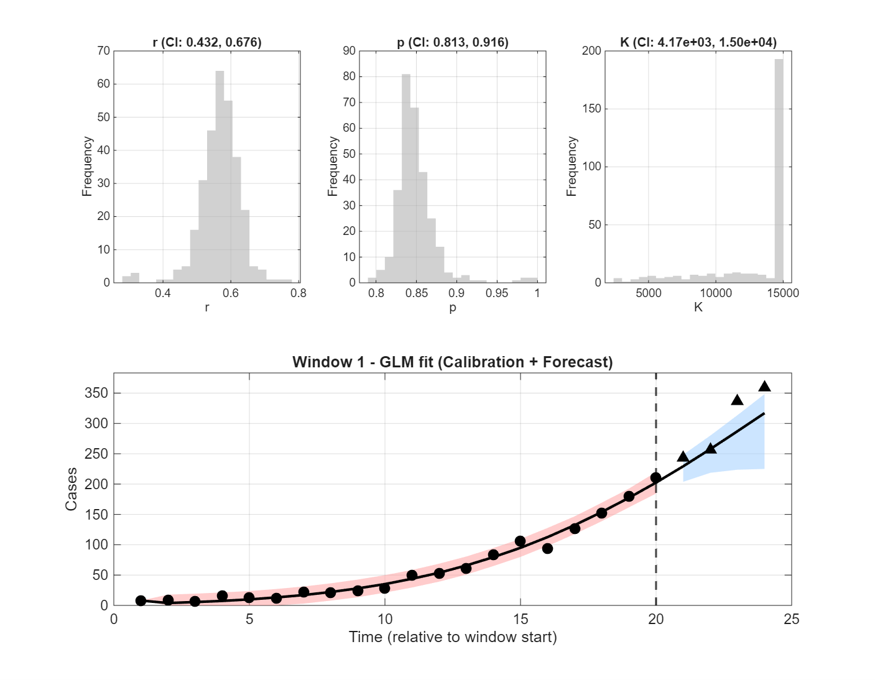
<figcaption aria-hidden="true">
GLM model fit, window
1
</figcaption>
</figure>

<figure>
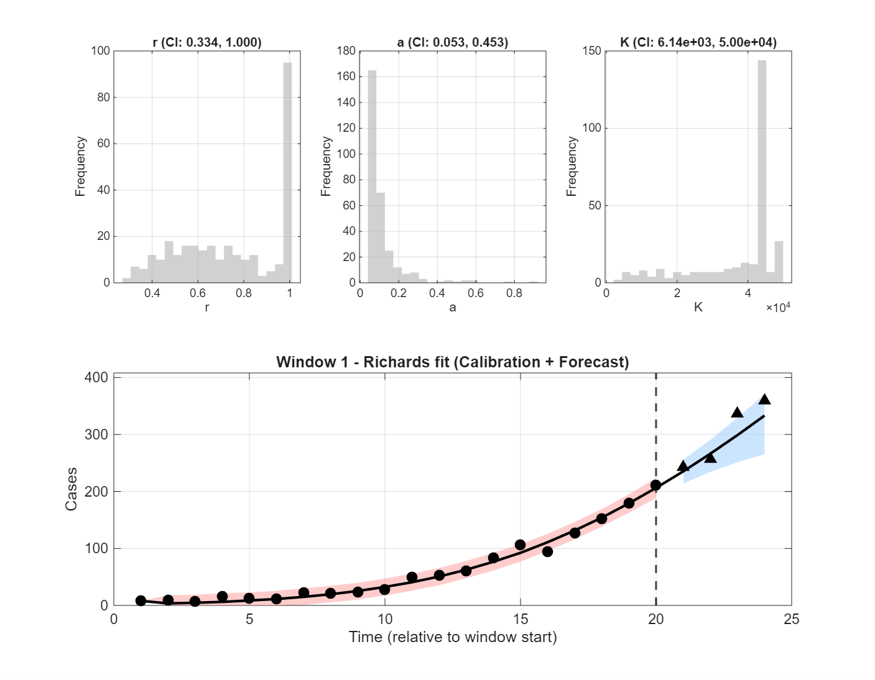
<figcaption aria-hidden="true">
Richards model fit, window
1
</figcaption>
</figure>

# 3. Individual model forecasts

<figure>
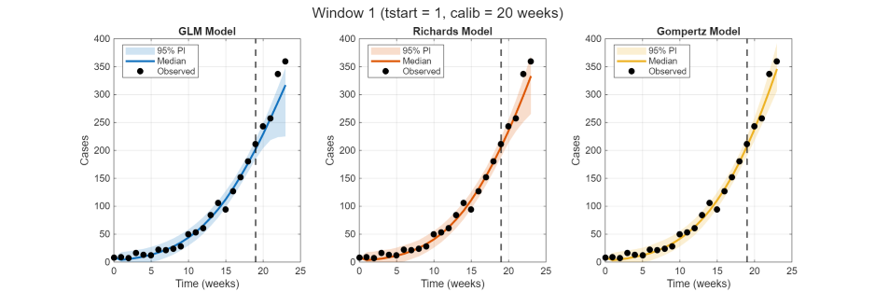
<figcaption aria-hidden="true">
All models, window 1 (earliest
window)
</figcaption>
</figure>

<figure>
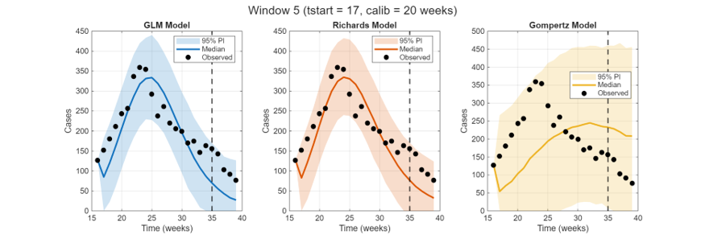
<figcaption aria-hidden="true">
All models, window 5 (latest
window)
</figcaption>
</figure>

\[COMPARE THE TWO. Which model looks best early, and is it still best
late? If the ranking changes between these two figures, that is the
phenomenon this whole project is about. If one model dominates
throughout, say so --- that is a legitimate finding, and it predicts
that ensemble weighting will not help much.\]

# 4. Baseline ensemble (calibration-only weights)

Models weighted by inverse calibration WIS,
$\omega_{i} \propto 1/{WIS}_{i}^{cal}$, combined with the linear pool.

<figure>
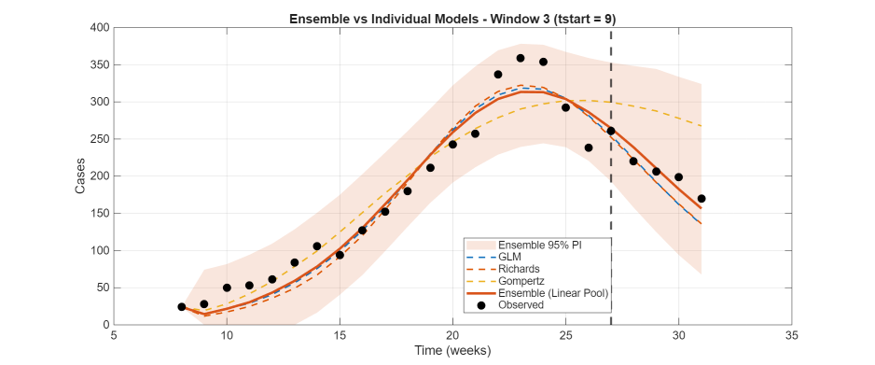
<figcaption aria-hidden="true">
Calibration-only ensemble vs
individual models, window 3
</figcaption>
</figure>

<figure>
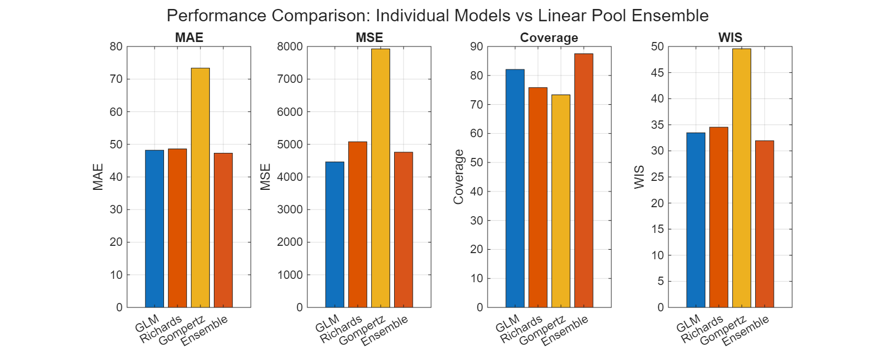
<figcaption aria-hidden="true">
Performance: individual models vs
calibration-only ensemble
</figcaption>
</figure>

<figure>
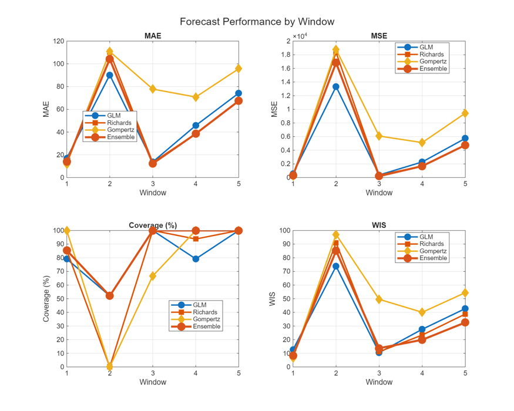
<figcaption aria-hidden="true">
Forecast metrics by
window
</figcaption>
</figure>

\[DOES THE ENSEMBLE BEAT ITS COMPONENTS? Note whether ensemble coverage
sits above the nominal 95%. Linear pools retain disagreement between
models rather than averaging it away, so over-coverage is expected
behaviour, not a bug.\]

# 5. JCF ensemble

JCF blends the current window's calibration WIS with the immediately
preceding window's forecast WIS:

$$S_{i,w} = \lambda\,{WIS}_{i,w}^{cal} + (1 - \lambda)\,{WIS}_{i,w - 1}^{for},\quad\quad\omega_{i,w} = \frac{1/S_{i,w}}{\sum_{j}^{}1/S_{j,w}}.$$

Window 1 has no preceding forecast, so it falls back to calibration WIS
alone.

<figure>
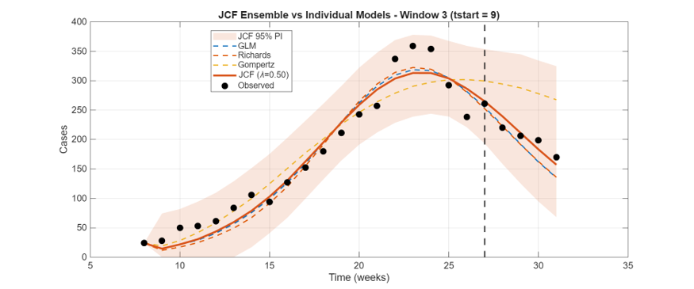
<figcaption aria-hidden="true">
JCF ensemble vs individual models,
window 3
</figcaption>
</figure>

<figure>
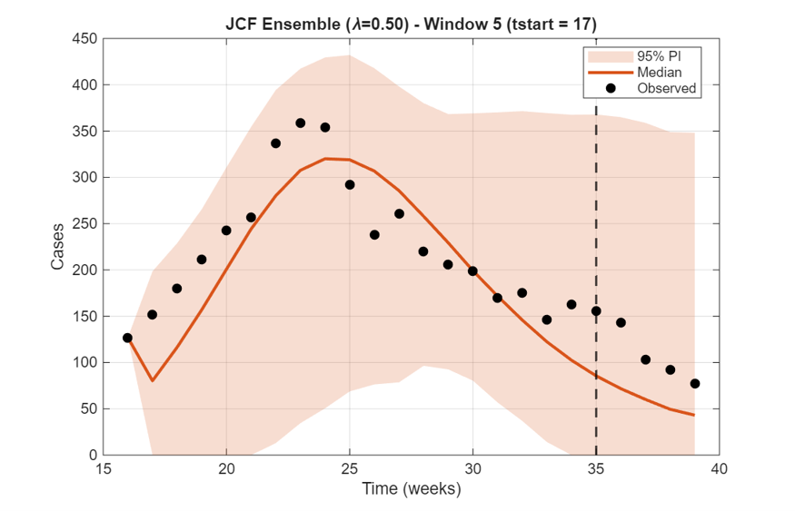
<figcaption aria-hidden="true">
JCF ensemble forecast, window
5
</figcaption>
</figure>

## 5.1 How the weights move

<figure>
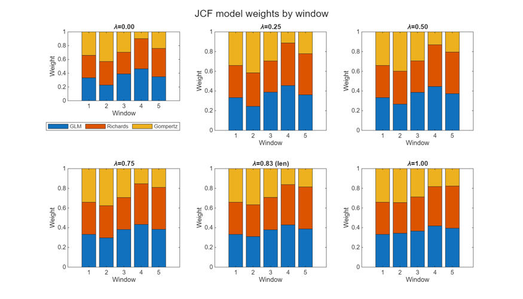
<figcaption aria-hidden="true">
JCF model weights by window, for each
<em>λ</em>
</figcaption>
</figure>

\[THIS IS THE MOST INFORMATIVE FIGURE IN THE REPORT. Flat bars across
windows mean JCF is barely changing anything. Bars that shift mean it is
reallocating weight as the epidemic turns --- say which model gains,
which loses, and at which window. If the weights collapse onto a single
model, JCF is doing adaptive model *selection* rather than combination;
that is worth stating explicitly.\]

# 6. Sensitivity to $\lambda$

<figure>
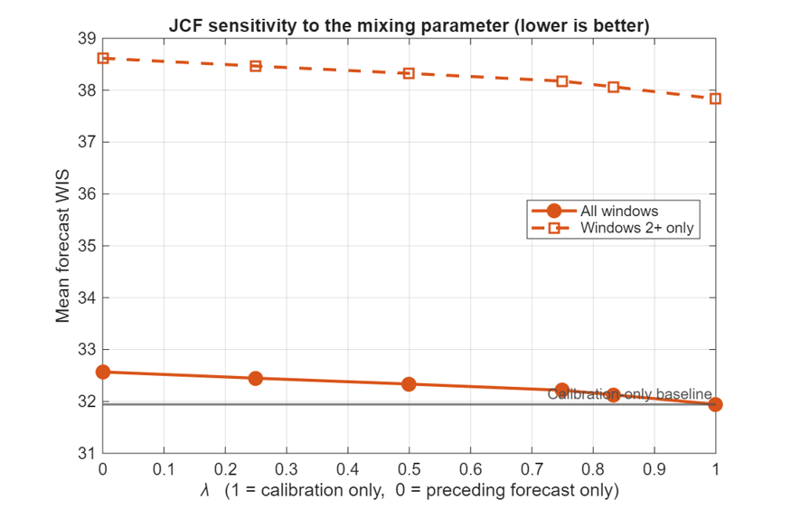
<figcaption aria-hidden="true">
Mean forecast WIS against <em>λ</em>
</figcaption>
</figure>

\[IS THERE AN INTERIOR OPTIMUM? $\lambda = 1$ is calibration-only and
$\lambda = 0$ is forecast-only, so an interior minimum is the case for
JCF being worth its complexity. A monotone curve says one of the two
endpoints is simply better. Note where the length-weighted point ("len")
falls --- and remember that with a long calibration period it sits close
to $\lambda = 1$ by arithmetic alone, so it has little room to differ.\]

# 7. Scheme comparison

<figure>
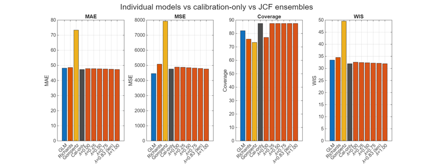
<figcaption aria-hidden="true">
Individual models vs calibration-only
vs JCF
</figcaption>
</figure>

<figure>
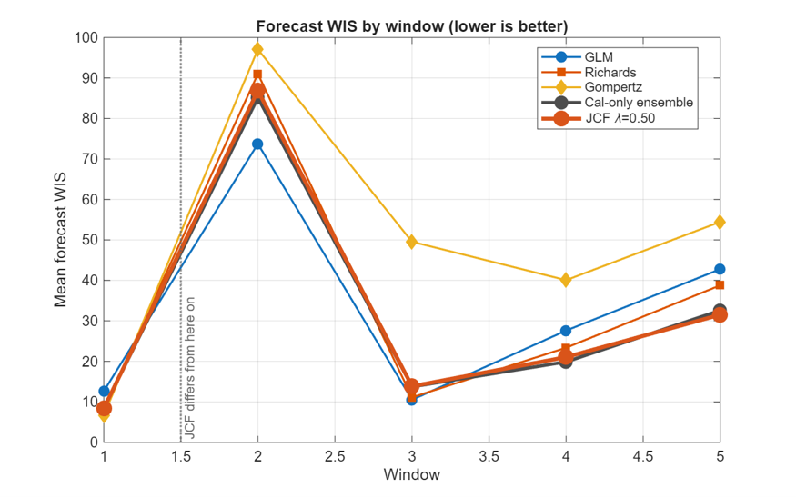
<figcaption aria-hidden="true">
Forecast WIS by window, all
schemes
</figcaption>
</figure>

**Table 1. Performance by weighting scheme.** *Paste*
`ensemble_scheme_comparison.csv` *here.*

  -----------------------------------------------------------------------------
  Scheme                   MAE   MSE   Coverage   WIS   WIS (windows    Skill %
                                                        2+)             
  ------------------------ ----- ----- ---------- ----- --------------- -------
  \[GLM\]                                                               

  \[Richards\]                                                          

  \[Gompertz\]                                                          

  \[Ensemble:                                                           
  calibration-only\]                                                    

  \[Ensemble: JCF λ=0.50\]                                              

  \[Ensemble: JCF λ=0.83                                                
  (len)\]                                                               
  -----------------------------------------------------------------------------

Skill is relative to the calibration-only ensemble; positive means JCF
improved on it.

> **Read the windows-2+ column, not just the overall WIS.** Window 1 is
> identical under JCF and calibration-only weighting by construction, so
> including it dilutes any real difference toward zero. With $W = 5$,
> only four windows carry information about whether JCF helped.

**Verification.** `compare_ensembles_jcf` checks that $\lambda = 1$
reproduces the calibration-only baseline exactly, since the two are
algebraically the same scheme. Result: \[CHECK PASSED / did not pass ---
if it did not, nothing below is interpretable until it does\].

# 8. Discussion

\[WRITE 3--5 PARAGRAPHS. Suggested ground to cover:\]

**Did JCF help?** \[State the skill score plainly, including the sign. A
negative result carefully demonstrated is a good outcome and should be
reported as confidently as a positive one.\]

**Why, mechanically?** \[Tie the answer back to the weight-trajectory
figure. If JCF helped, it should be visible there as weight moving
toward a model that went on to forecast well. If it did not help, was it
because the weights barely moved, or because they moved the wrong way?\]

**How does this depend on the epidemic phase?** \[Point at the by-window
figure. Did the schemes diverge most around the peak, where models
disagree most?\]

**Limitations.** \[At minimum: only four informative windows; a single
dataset; Monte Carlo noise in the ensemble WIS from trajectory sampling;
and the fact that the length-weighted variant is constrained by the
$C/H$ ratio you chose.\]

**What would you do with more time?** \[E.g. vary the $C/H$ ratio, widen
the model panel, or test whether the conclusion survives a different
error structure.\]

# 9. Reproducibility

  ----------------------------------------------------------------------------
  Item                                Value
  ----------------------------------- ----------------------------------------
  Toolbox                             QuantDiffForecast (MATLAB)

  Ensemble                            Linear pool,
                                      `getensemble_linearpool_from_curves.m`

  Scoring                             Weighted interval score, `computeWIS.m`,
                                      11 interval levels

  Bootstrap replicates                \[300\]

  Ensemble seed (`ens_seed`)          \[1\]

  $\lambda$ values run                \[0, 0.25, 0.5, 0.75, length, 1\]

  Scripts                             `create_ensemble_jcf.m`,
                                      `run_jcf_sweep.m`,
                                      `compare_ensembles_jcf.m`,
                                      `plot_forecasts_jcf.m`
  ----------------------------------------------------------------------------

\[LIST ANY DEVIATIONS from the defaults --- changed bounds, a different
model panel, a different window design.\]

